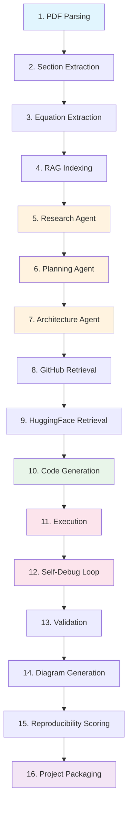
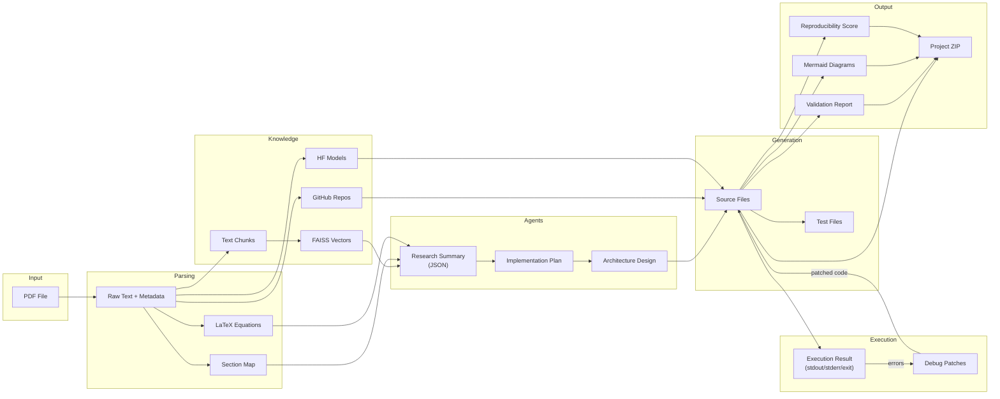
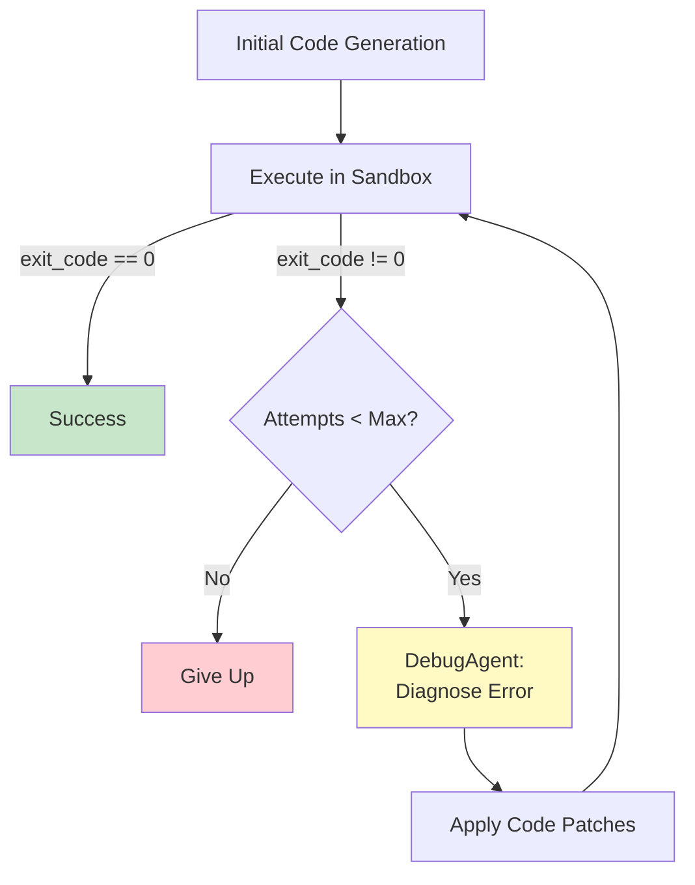

# ReagentAI -- System Documentation

Comprehensive technical documentation for the ReagentAI autonomous paper-to-code system.

---

## Table of Contents

1. [System Architecture](#1-system-architecture)
2. [Pipeline Stages](#2-pipeline-stages)
3. [Agent Roles](#3-agent-roles)
4. [Data Flow](#4-data-flow)
5. [Retrieval Architecture](#5-retrieval-architecture)
6. [Execution Sandbox Design](#6-execution-sandbox-design)
7. [Debugging Loop](#7-debugging-loop)
8. [Frontend Architecture](#8-frontend-architecture)
9. [Agent Memory](#9-agent-memory)

---

## 1. System Architecture

ReagentAI is a full-stack application composed of three services: a **Python/FastAPI backend** that orchestrates the AI pipeline, a **Next.js/React frontend** that provides the user interface, and a **Docker sandbox** that executes generated code in isolation. Communication between frontend and backend occurs over REST APIs and WebSocket connections.

### High-Level Architecture

```
+------------------------------------------------------+
|                     USER BROWSER                      |
|   +------------------------------------------------+ |
|   |        Next.js / React / Tailwind Frontend      | |
|   |  UploadPaper | AgentProgress | CodeViewer | Chat| |
|   +---------------------+--------------------------+ |
+-------------------------|----------------------------+
                          |  REST API + WebSocket
                          v
+------------------------------------------------------+
|                    FASTAPI BACKEND                    |
|                                                      |
|  +------------------+    +------------------------+  |
|  |   PDF Parser     |    |   RAG Pipeline         |  |
|  |  - Text extract  |    |  - Chunking            |  |
|  |  - Sections      |--->|  - Embedding (mpnet)   |  |
|  |  - Equations     |    |  - FAISS indexing      |  |
|  +------------------+    |  - Semantic retrieval   |  |
|                          +------------------------+  |
|  +------------------------------------------------+  |
|  |            MULTI-AGENT PIPELINE                 |  |
|  |  Research -> Planning -> Architecture -> Coding |  |
|  |  Testing -> Debug -> Validation -> Diagram      |  |
|  +------------------------------------------------+  |
|                                                      |
|  +------------------+    +------------------------+  |
|  | GitHub Retrieval  |    | HuggingFace Retrieval  |  |
|  | - Keyword extract |    | - Model family detect  |  |
|  | - Repo search     |    | - Hub API search       |  |
|  | - Code extraction |    | - Checkpoint retrieval |  |
|  +------------------+    +------------------------+  |
|                                                      |
|  +------------------+    +------------------------+  |
|  | Code Generator   |    | Agent Memory (FAISS)   |  |
|  | - File synthesis  |    | - research_memory      |  |
|  | - Disk writer     |    | - architecture_memory  |  |
|  +------------------+    | - debug_memory         |  |
|                          +------------------------+  |
+-------------------------|----------------------------+
                          |  Docker SDK
                          v
+------------------------------------------------------+
|                  DOCKER SANDBOX                       |
|  +------------------------------------------------+  |
|  |  python:3.11-slim container                     |  |
|  |  - Project mounted at /workspace               |  |
|  |  - Resource limits (2 GB RAM, 2 CPUs)           |  |
|  |  - Network disabled                             |  |
|  |  - 300s execution timeout                       |  |
|  |  - stdout/stderr captured                       |  |
|  +------------------------------------------------+  |
+------------------------------------------------------+
                          |
                          v
              +---------------------+
              |   Downloadable ZIP  |
              |  (code + tests +    |
              |   configs + docs)   |
              +---------------------+
```

### Service Communication

- **Frontend to Backend**: HTTP REST for CRUD operations; WebSocket at `/ws/pipeline/{id}` for real-time stage progress, log streaming, and pipeline completion notifications.
- **Backend to Docker**: Docker SDK (`docker-py`) manages container lifecycle -- `create`, `start`, `wait`, `logs`, `remove`.
- **Backend to HuggingFace**: HTTP POST to the Inference API (`api-inference.huggingface.co`) for LLM completions; HTTP GET to the Hub API (`huggingface.co/api/models`) for model search.
- **Backend to GitHub**: HTTP GET to the GitHub Search API (`api.github.com/search/repositories`) for repository discovery.

---

## 2. Pipeline Stages

The master pipeline (`backend/orchestration/pipeline.py`) executes 16 stages sequentially. Each stage reports its status (`pending` | `running` | `completed` | `failed`) to the frontend via the WebSocket progress callback.



### Stage Details

| # | Stage | Module | Description |
|---|-------|--------|-------------|
| 1 | **PDF Parsing** | `backend/parser/pdf_parser.py` | Extracts raw text, page count, metadata (title, authors, abstract) from the uploaded PDF using PyMuPDF and pdfplumber. |
| 2 | **Section Extraction** | `backend/parser/section_extractor.py` | Identifies structural sections (Abstract, Introduction, Methodology, Experiments, Results, Conclusion, References) by detecting heading patterns and formatting cues. |
| 3 | **Equation Extraction** | `backend/parser/equation_extractor.py` | Parses LaTeX equations from the paper text using regex patterns and SymPy for validation. Returns equation name, LaTeX representation, and plain-English description. |
| 4 | **RAG Indexing** | `backend/retrieval/rag_pipeline.py` | Chunks the paper text into overlapping 512-character segments, encodes each chunk using `all-mpnet-base-v2`, and inserts the vectors into the FAISS index with metadata (paper ID, chunk index, source text). |
| 5 | **Research Agent** | `backend/agents/research_agent.py` | Sends the paper text (truncated to 12,000 chars) to Llama-3 with a structured extraction prompt. Returns a JSON dictionary containing: algorithm description, architecture components, datasets, hyperparameters, training strategy, equations, and summary. |
| 6 | **Planning Agent** | `backend/agents/planning_agent.py` | Receives the research summary and produces an ordered implementation plan: file list, module responsibilities, dependency graph, data pipeline steps, training loop structure, and evaluation metrics. Uses Mixtral for its strong reasoning capabilities. |
| 7 | **Architecture Agent** | `backend/agents/architecture_agent.py` | Converts the plan into a concrete project directory layout: folder hierarchy, class/function signatures, module interfaces, and configuration file templates. Uses Mixtral for structural design. |
| 8 | **GitHub Retrieval** | `backend/retrieval/github_search.py` | Extracts keywords (model names, dataset names, CamelCase identifiers) from the paper text, constructs a GitHub search query, retrieves matching repositories sorted by stars, and returns structured metadata. Repositories are ranked by `backend/retrieval/repo_ranker.py` and key code is extracted by `backend/retrieval/code_extractor.py`. |
| 9 | **HuggingFace Retrieval** | `backend/retrieval/huggingface_retrieval.py` | Identifies model family references in the paper (BERT, GPT, ViT, etc.), searches the HuggingFace Hub API for matching pre-trained models, and returns model IDs, pipeline tags, download counts, and library frameworks. |
| 10 | **Code Generation** | `backend/orchestration/code_generator.py` | The CodingAgent generates all project files (Python source, configuration YAML, `requirements.txt`, `README.md`, shell scripts) from the plan, architecture, research summary, and reference code. Files are written to `generated_projects/{project_id}/`. |
| 11 | **Execution** | `backend/execution/code_runner.py` | The generated project is installed (`pip install -r requirements.txt`) and executed (`python src/trainer.py`) inside a Docker sandbox. stdout, stderr, and exit code are captured. |
| 12 | **Self-Debug Loop** | `backend/orchestration/debug_loop.py` | If execution fails, the DebugAgent receives the error output and source code, diagnoses the root cause, and produces corrected file patches. The project is re-executed. This repeats for up to 5 attempts (configurable via `MAX_DEBUG_ATTEMPTS`). |
| 13 | **Validation** | `backend/orchestration/validator.py` | Runs a suite of static and runtime validation checks: syntax correctness, import resolution, file structure compliance, output shape verification, and metric computation. Returns a pass/fail report with detailed messages. |
| 14 | **Diagram Generation** | `backend/orchestration/diagram_generator.py` | The DiagramAgent generates Mermaid.js diagram source code for the implemented architecture (class diagrams, data flow graphs, training pipeline visualisations). |
| 15 | **Reproducibility Scoring** | `backend/orchestration/reproducibility.py` | Scores the generated project across multiple categories (code completeness, dataset handling, hyperparameter fidelity, training procedure adherence, evaluation metric coverage). Produces an overall score (0-100) and actionable feedback. |
| 16 | **Project Packaging** | `backend/orchestration/project_packager.py` | Bundles all generated files (source code, tests, configurations, diagrams, validation report, reproducibility score) into a `.zip` archive stored at `generated_projects/{project_id}.zip`. |

---

## 3. Agent Roles

All agents inherit from `BaseAgent` (`backend/agents/base_agent.py`), which provides:
- A `call_model()` method that communicates with the HuggingFace Inference API with exponential back-off for 503 (model loading) and 429 (rate-limited) responses.
- Structured reasoning logging via `log_reasoning()`.
- A `_build_prompt()` helper that formats system/user instruction pairs in the Llama instruction template.

### 3.1 Research Agent

| Property | Value |
|----------|-------|
| **Class** | `ResearchAgent` |
| **Model** | `meta-llama/Meta-Llama-3-8B-Instruct` (Llama-3) |
| **Input** | `paper_text` (str), `paper_title` (str) |
| **Output** | `algorithm`, `architecture_components`, `datasets`, `hyperparameters`, `training_strategy`, `equations`, `summary` |
| **Responsibility** | Reads the raw paper text and extracts a structured JSON summary of the paper's contribution. This summary is the foundation consumed by all downstream agents. Truncates input to 12,000 characters to fit within the model's context window. |

### 3.2 Planning Agent

| Property | Value |
|----------|-------|
| **Class** | `PlanningAgent` |
| **Model** | `mistralai/Mixtral-8x7B-Instruct-v0.1` (Mixtral) |
| **Input** | Research summary (from ResearchAgent) |
| **Output** | Implementation plan: file list, module responsibilities, dependency graph, data pipeline steps, training loop structure, evaluation metrics |
| **Responsibility** | Translates the research summary into a concrete, step-by-step implementation plan. Determines what files need to be created, how modules depend on each other, and what the training/evaluation pipeline looks like. Mixtral's strong reasoning and long context make it well-suited for plan synthesis. |

### 3.3 Architecture Agent

| Property | Value |
|----------|-------|
| **Class** | `ArchitectureAgent` |
| **Model** | `mistralai/Mixtral-8x7B-Instruct-v0.1` (Mixtral) |
| **Input** | Research summary, implementation plan |
| **Output** | Project directory layout, class/function signatures, module interfaces, configuration templates |
| **Responsibility** | Designs the software architecture of the generated project. Defines folder structure, class hierarchies, function signatures, and inter-module interfaces. Ensures the architecture is idiomatic, modular, and testable. |

### 3.4 Coding Agent

| Property | Value |
|----------|-------|
| **Class** | `CodingAgent` |
| **Model** | `meta-llama/CodeLlama-34b-Instruct-hf` (CodeLlama) |
| **Input** | Plan, architecture, research summary, reference code (from GitHub), pre-trained model suggestions (from HuggingFace) |
| **Output** | Complete source files (Python modules, configs, requirements, README, scripts) |
| **Responsibility** | Generates all source code files for the ML project. Uses CodeLlama's strong code generation capabilities to produce syntactically correct, runnable Python code that implements the paper's algorithm according to the plan and architecture. |

### 3.5 Testing Agent

| Property | Value |
|----------|-------|
| **Class** | `TestingAgent` |
| **Model** | `meta-llama/CodeLlama-34b-Instruct-hf` (CodeLlama) |
| **Input** | Generated source files, architecture, research summary |
| **Output** | Test files (unit tests, integration tests) |
| **Responsibility** | Generates pytest test cases that verify the correctness of the generated code. Tests cover model instantiation, forward pass shapes, data loading, training step execution, and metric computation. |

### 3.6 Debug Agent

| Property | Value |
|----------|-------|
| **Class** | `DebugAgent` |
| **Model** | `meta-llama/CodeLlama-34b-Instruct-hf` (CodeLlama) |
| **Input** | Error output (stderr/stdout), current source files, attempt number, previous fix history |
| **Output** | `diagnosis` (root cause), `corrected_files` (patched source code), `changes_summary`, `confidence` score |
| **Responsibility** | Analyses runtime errors from failed execution attempts and produces targeted code fixes. Receives the full error traceback, the current state of all source files, and a history of previous fix attempts to avoid repeating failed strategies. Returns corrected file contents and a confidence score (0.0-1.0). |

### 3.7 Validation Agent

| Property | Value |
|----------|-------|
| **Class** | `ValidationAgent` |
| **Model** | `meta-llama/CodeLlama-34b-Instruct-hf` (CodeLlama) |
| **Input** | Generated source files, execution results, research summary |
| **Output** | Validation report with per-check pass/fail status and messages |
| **Responsibility** | Runs a comprehensive suite of validation checks against the generated project: syntax validation, import correctness, structural compliance (required files exist), output shape verification, and metric computation accuracy. |

### 3.8 Diagram Agent

| Property | Value |
|----------|-------|
| **Class** | `DiagramAgent` |
| **Model** | `mistralai/Mixtral-8x7B-Instruct-v0.1` (Mixtral) |
| **Input** | Architecture, plan, generated source code |
| **Output** | Mermaid.js diagram source code (class diagrams, data flow, training pipeline) |
| **Responsibility** | Generates visual architecture diagrams in Mermaid.js syntax. Produces class relationship diagrams, data flow diagrams showing tensor shapes, and training pipeline visualisations. Mixtral's structured output capabilities make it well-suited for generating syntactically valid Mermaid code. |

### 3.9 Chat Agent

| Property | Value |
|----------|-------|
| **Class** | `ChatAgent` |
| **Model** | `meta-llama/Meta-Llama-3-8B-Instruct` (Llama-3) |
| **Input** | User question, RAG-retrieved context chunks from the paper |
| **Output** | Answer text, source citations |
| **Responsibility** | Powers the paper Q&A interface. When a user asks a question, the RAG pipeline retrieves the most relevant paper chunks, which are injected into the Llama-3 prompt as context. The agent produces a grounded answer with citations pointing back to specific paper sections. |

---

## 4. Data Flow

The following diagram traces how data transforms as it moves through the pipeline, from raw PDF upload to downloadable project.



### Data Transformation Summary

| From | To | Transformation |
|------|----|----------------|
| PDF binary | Raw text + metadata | PyMuPDF/pdfplumber text extraction |
| Raw text | Section map | Heading pattern detection, boundary inference |
| Raw text | LaTeX equations | Regex extraction, SymPy validation |
| Raw text | FAISS vectors | Chunking (512 chars, 50 overlap) + `all-mpnet-base-v2` encoding |
| Paper text + sections + equations | Research summary (JSON) | Llama-3 structured extraction prompt |
| Research summary | Implementation plan | Mixtral plan synthesis |
| Plan | Architecture design | Mixtral structural design |
| Plan + architecture + research + reference code | Source files | CodeLlama code generation |
| Source files + sandbox | Execution result (stdout/stderr/exit) | Docker container execution |
| Error output + source files | Debug patches | CodeLlama error diagnosis and code correction |
| Source files + execution results | Validation report | CodeLlama static + runtime checks |
| Architecture + source code | Mermaid diagrams | Mixtral diagram synthesis |
| All artifacts | Reproducibility score | Multi-category scoring engine |
| All artifacts | ZIP archive | `shutil.make_archive` packaging |

---

## 5. Retrieval Architecture

### 5.1 RAG Pipeline

The Retrieval-Augmented Generation pipeline (`backend/retrieval/rag_pipeline.py`) provides the semantic search layer that all agents and the chat interface rely on.

**Chunking**: Documents are split into overlapping character-level segments using a sliding window. Default parameters: `chunk_size=512` characters, `chunk_overlap=50` characters. The overlap ensures that sentences spanning chunk boundaries remain retrievable in at least one chunk.

**Embedding**: Each chunk is encoded into a 768-dimensional dense vector using `sentence-transformers/all-mpnet-base-v2`. Embeddings are L2-normalised so that inner product equals cosine similarity. The embedding model is lazy-loaded on first use and supports configurable batch sizes (default: 64).

**FAISS Indexing**: Vectors are stored in a `faiss.IndexFlatIP` (inner product) index. A parallel metadata list maintains the source text, paper ID, chunk index, and any extra metadata for each vector. The store supports atomic persistence: the FAISS index is written to `index.faiss` and the metadata sidecar to `metadata.pkl` within the configured `VECTOR_STORE_PATH` directory.

**Semantic Search**: Given a natural-language query, the query text is embedded using the same model. FAISS performs exact inner-product search against all stored vectors, returning the top-K most similar chunks (default K=5). Results include the matched text, similarity score, and source metadata.

**Context Building**: Retrieved chunks are concatenated (separated by horizontal rules) into a single context string, respecting a character budget (default: 8,000 chars). This context string is injected into agent prompts for RAG-augmented generation.

```
 User Query                          LLM Prompt
     |                                   ^
     v                                   |
 [Embedding Model]               [Context + Query]
     |                                   ^
     v                                   |
 [FAISS Search] -----> [Top-K Chunks] ---+
     ^
     |
 [Indexed Paper Vectors]
```

### 5.2 GitHub Search

The GitHub search module (`backend/retrieval/github_search.py`) discovers reference implementations:

1. **Keyword Extraction**: Scans the paper text for known model names (60+ entries: BERT, GPT, ViT, YOLO, etc.), known dataset names (25+ entries: ImageNet, CIFAR, COCO, etc.), CamelCase identifiers (e.g., FlashAttention, LoRaAdapter), and UPPER_CASE identifiers (e.g., RLHF, PPO, DPO). Stopwords are filtered out.

2. **Query Construction**: Keywords are sorted by length (shorter = more specific) and the top 8 are joined into a space-separated GitHub search query.

3. **Repository Search**: An authenticated GET request is sent to `api.github.com/search/repositories`, sorted by stars descending. Results are capped at the configured `per_page` limit (default: 30).

4. **Ranking**: The `RepoRanker` (`backend/retrieval/repo_ranker.py`) scores repositories by relevance using signals such as star count, recency, topic overlap, and language match.

5. **Code Extraction**: The `CodeExtractor` (`backend/retrieval/code_extractor.py`) retrieves key source files from top-ranked repositories, providing reference code patterns for the CodingAgent.

### 5.3 HuggingFace Retrieval

The HuggingFace retrieval module (`backend/retrieval/huggingface_retrieval.py`) finds relevant pre-trained models:

1. **Model Family Detection**: Scans the paper text against a dictionary of 40+ known model families (BERT, GPT, T5, Llama, ViT, Stable Diffusion, Whisper, etc.) and their associated Hub search terms.

2. **Hub Reference Detection**: Regex patterns identify HuggingFace-style model references (e.g., `org/model-name`) and size-qualified checkpoints (e.g., `BERT-base`, `T5-3B`).

3. **Hub API Search**: For each extracted query, an authenticated GET request is sent to `huggingface.co/api/models` with sort-by-downloads. Results are deduplicated by model ID, keeping the version with more downloads.

4. **Model Details**: Individual model details (pipeline tag, library framework, download count, tags) can be fetched via `get_model_details()` for downstream use by the CodingAgent.

---

## 6. Execution Sandbox Design

The Docker sandbox (`backend/execution/sandbox.py`) provides isolated execution of generated ML projects.

### Container Lifecycle

1. **Image Verification**: On first use, the sandbox checks whether the configured image (`python:3.11-slim` by default) is available locally. If not, it is pulled from Docker Hub.

2. **Container Creation**: A fresh container is created for every execution attempt with the following configuration:
   - **Image**: `python:3.11-slim` (configurable via `SANDBOX_IMAGE`)
   - **Working directory**: `/workspace`
   - **Volume mount**: The generated project directory is bind-mounted read-write at `/workspace`
   - **Memory limit**: `2g` (configurable via `SANDBOX_MEMORY_LIMIT`)
   - **CPU limit**: 2 CPUs (via `nano_cpus`)
   - **Network mode**: `none` (networking is disabled to prevent exfiltration)
   - **Command**: Executed via `bash -c "<command>"`

3. **Execution**: The container is started and the backend waits for completion with a configurable timeout (default: 300 seconds). If the timeout is exceeded, the container is force-stopped.

4. **Output Capture**: stdout and stderr are captured separately via `container.logs()`. The exit code is extracted from the container's wait result.

5. **Cleanup**: The container is force-removed after every execution attempt, regardless of success or failure. This ensures a clean environment for each debug-loop iteration and prevents resource leaks.

### Resource Limits

| Resource | Default | Environment Variable |
|----------|---------|---------------------|
| Memory | 2 GB | `SANDBOX_MEMORY_LIMIT` |
| CPUs | 2 | (hardcoded) |
| Timeout | 300s | `SANDBOX_TIMEOUT` |
| Network | Disabled | (hardcoded `none`) |
| Filesystem | Read-write mount of project directory only | -- |

### SandboxResult

Every execution returns a `SandboxResult` dataclass containing:
- `exit_code` (int): Process exit code (0 = success)
- `stdout` (str): Captured standard output
- `stderr` (str): Captured standard error
- `timed_out` (bool): Whether the execution exceeded the timeout
- `execution_time` (float): Wall-clock seconds
- `container_id` (str): Docker container ID for diagnostics

---

## 7. Debugging Loop

The self-debug loop (`backend/orchestration/debug_loop.py`) implements an automated fix cycle that iteratively repairs runtime errors in the generated code.

### Cycle



### Step-by-Step

1. **Generate**: The `CodeGenerationPipeline` produces the initial set of project files on disk.
2. **Execute**: The `CodeRunner` installs dependencies and runs the project entry point (`python src/trainer.py`) inside the Docker sandbox.
3. **Capture Errors**: If the exit code is non-zero, stdout and stderr are captured. If dependency installation failed, install errors are prepended to the error output.
4. **DebugAgent Diagnosis**: The DebugAgent receives a context dictionary containing:
   - `error_output`: Combined stderr/stdout error text
   - `files`: Dictionary of all current source files (path -> content)
   - `attempt`: Current attempt number (1-based)
   - `previous_fixes`: Summaries of all prior fix attempts (to avoid repeating failed strategies)
   - `research_summary`: Original paper research context (optional)
5. **Apply Patches**: The DebugAgent returns `corrected_files` (a dict of file path -> new content) and a `diagnosis` string. Corrected files are merged into the project and written to disk.
6. **Re-execute**: The patched project is executed again from step 2.
7. **Repeat**: Steps 2-6 repeat until execution succeeds or the maximum attempt count is reached.

### Configuration

- **Max attempts**: Controlled by `MAX_DEBUG_ATTEMPTS` (default: 5). This includes the initial execution attempt.
- **Iteration history**: Every attempt is recorded as an `IterationRecord` containing: attempt number, execution result, error type, error message, diagnosis, fix applied, corrected file paths, confidence score, and elapsed time.

### DebugLoopResult

The final output is a `DebugLoopResult` dataclass:
- `final_success` (bool): Whether the project ultimately ran successfully
- `attempts_made` (int): Total number of execution attempts
- `iteration_history` (list[IterationRecord]): Full history of every attempt
- `final_code` (dict[str, str]): Final state of all source files
- `project_id` (str): Project identifier
- `project_dir` (str): Absolute path to the project directory
- `total_elapsed` (float): Wall-clock seconds for the entire loop

---

## 8. Frontend Architecture

The frontend is a Next.js 14 application using the App Router, React, TypeScript, and Tailwind CSS. It communicates with the backend via a typed API client and a WebSocket hook for real-time updates.

### Routing

| Route | Page | Description |
|-------|------|-------------|
| `/` | `app/page.tsx` | Home page with PDF upload form |
| `/dashboard/[id]` | `app/dashboard/[id]/page.tsx` | Project dashboard showing pipeline progress, generated code, diagrams, validation, score, chat, and download |

### Components

| Component | File | Description |
|-----------|------|-------------|
| **UploadPaper** | `components/UploadPaper.tsx` | PDF upload form with drag-and-drop support. Sends the file to `POST /api/upload` and redirects to the dashboard on success. |
| **AgentProgressViewer** | `components/AgentProgressViewer.tsx` | Real-time pipeline stage tracker. Displays each stage as a card with status indicators (pending/running/completed/error) and activity text. Updated via WebSocket messages. |
| **CodeViewer** | `components/CodeViewer.tsx` | Syntax-highlighted file explorer. Fetches the file tree from `GET /api/code/{id}` and individual file contents from `GET /api/code/{id}/file`. Displays a tree sidebar and a code panel with language-aware highlighting. |
| **LogsPanel** | `components/LogsPanel.tsx` | Live log stream panel. Displays log entries received via WebSocket with level-based colour coding (DEBUG, INFO, WARNING, ERROR). Auto-scrolls to the latest entry. |
| **ArchitectureDiagramViewer** | `components/ArchitectureDiagramViewer.tsx` | Mermaid.js diagram renderer. Fetches diagram source from `GET /api/diagrams/{id}` and renders interactive SVG diagrams using the Mermaid library. |
| **ChatInterface** | `components/ChatInterface.tsx` | Paper Q&A chat interface. Sends user messages to `POST /api/chat/{id}` and displays the AI's answer with source citations. Supports conversation history display. |
| **DownloadProject** | `components/DownloadProject.tsx` | Project download button. Fetches the zip archive from `GET /api/download/{id}` and triggers a browser download. |

### API Client

The typed API client (`lib/api.ts`) provides functions for every backend endpoint:

```typescript
api.uploadPaper(file: File): Promise<UploadResponse>
api.getProject(projectId: string): Promise<ProjectInfo>
api.getCodeFiles(projectId: string): Promise<FileTreeResponse>
api.getFileContent(projectId: string, filePath: string): Promise<FileContentResponse>
api.getDiagrams(projectId: string): Promise<DiagramsResponse>
api.getValidation(projectId: string): Promise<ValidationResponse>
api.getScore(projectId: string): Promise<ScoreResponse>
api.sendChatMessage(projectId: string, message: string): Promise<ChatResponse>
api.downloadProject(projectId: string): Promise<Blob>
```

All functions include typed request/response interfaces and unified error handling via the `ApiError` class. The base URL is configured via the `NEXT_PUBLIC_API_URL` environment variable (defaults to `http://localhost:8000`).

### WebSocket Hook

The `useWebSocket` hook (`lib/websocket.ts`) manages a persistent WebSocket connection for real-time pipeline updates:

- **Auto-connect**: Connects on mount when a valid `projectId` is provided.
- **Auto-reconnect**: Exponential back-off with jitter (1s initial, 30s max, 10 max attempts) on unexpected disconnections.
- **Message parsing**: Incoming JSON messages are parsed and accumulated in a `messages` state array. The latest message is also available as `lastMessage`.
- **Connection status**: Tracked as `connecting` | `connected` | `disconnected` | `error`.
- **Cleanup**: WebSocket is closed with code `1000` on component unmount; reconnect timers are cleared.

### WebSocket Message Types

| Event | Description |
|-------|-------------|
| `stage_update` | Pipeline stage status change (stage name, status, detail) |
| `log` | Log entry (level, message) |
| `project_info` | Initial project state snapshot on WebSocket connect |
| `pipeline_complete` | Pipeline finished successfully |
| `pipeline_error` | Pipeline finished with an error |

---

## 9. Agent Memory

The agent memory system (`backend/memory/agent_memory.py`) provides FAISS-backed long-term memory that persists observations, decisions, and findings across agent invocations.

### Architecture

The `AgentMemoryStore` maintains one FAISS `IndexFlatIP` index per memory type, keeping memories scoped to their domain and avoiding cross-contamination. All embeddings are produced by the shared `EmbeddingModel` and are L2-normalised, so inner-product search equals cosine similarity.

### Memory Types

| Memory Type | Purpose | Agents That Use It |
|-------------|---------|-------------------|
| `research_memory` | Paper findings, algorithm observations, dataset notes | ResearchAgent |
| `architecture_memory` | Design decisions, structural patterns, interface choices | ArchitectureAgent |
| `debug_memory` | Error patterns, fix strategies, known failure modes | DebugAgent |

### Operations

**Store**: Creates a `MemoryEntry` with a UUID, agent name, content string, memory type, Unix timestamp, and optional metadata. The content is embedded and added to the corresponding FAISS index. Auto-persisted to disk after every store call (configurable).

**Recall**: Embeds a natural-language query and performs cosine similarity search against the specified memory-type index. Returns up to `top_k` `MemoryEntry` objects sorted by relevance score.

**Agent-scoped retrieval**: Returns all memories created by a specific agent, optionally filtered by memory type, sorted by timestamp (newest first). This is a non-semantic, exhaustive scan.

### Persistence Layout

```
vector_store/
  agent_memory/
    research_memory/
      index.faiss          # FAISS inner-product index
      metadata.pkl         # Pickled list of MemoryEntry dicts
    architecture_memory/
      index.faiss
      metadata.pkl
    debug_memory/
      index.faiss
      metadata.pkl
```

### MemoryEntry Schema

| Field | Type | Description |
|-------|------|-------------|
| `id` | `str` | UUID4 hex string |
| `agent_name` | `str` | Creating agent (e.g., `"ResearchAgent"`) |
| `content` | `str` | Free-text memory content |
| `memory_type` | `str` | One of `research_memory`, `architecture_memory`, `debug_memory` |
| `timestamp` | `float` | Unix epoch creation time |
| `metadata` | `dict` | Arbitrary extra data (paper IDs, error hashes, config snapshots) |
| `relevance_score` | `float` | Cosine similarity score (set during recall; 0.0 for non-search retrievals) |

### Design Decisions

- **Separate indexes per type**: Prevents research observations from polluting debug searches and vice versa. Each domain has its own vector space.
- **Lazy dimension resolution**: The embedding dimensionality is not known at construction time. It is resolved on the first store/recall call by loading the embedding model, keeping startup fast.
- **Auto-load on init**: If persisted indexes exist on disk, they are automatically restored at construction time, providing continuity across backend restarts.
- **Auto-save after writes**: Each `store()` call triggers an immediate persist to disk, ensuring no memories are lost on unexpected termination.
